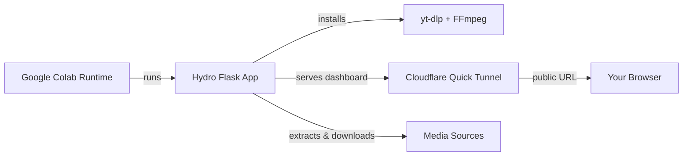

<div align="center">

# Hydro

A single-file **media download desk** for Google Colab — videos, playlists, audio, and images, delivered through a free Cloudflare Quick Tunnel.

[](LICENSE)
[](https://github.com/Code-Leafy/hydro/stargazers)
[](https://python.org)
[](https://flask.palletsprojects.com)
[](https://colab.research.google.com)

[](https://colab.research.google.com/github/Code-Leafy/hydro/blob/main/hydro.ipynb)

</div>

---

<div align="center">


</div>

<br>

## Overview

Hydro is a complete media downloader that runs entirely inside a free Google Colab session — no server, no paid service, and no API keys. The entire app is one self-contained `main.py` file: on launch it quietly installs Flask, yt-dlp, and FFmpeg, starts a local web dashboard, and publishes it to the internet with Cloudflare's free Quick Tunnel.

Paste a link into the dashboard, choose a video, audio, or image path, and download through your browser. Playlists, quality profiles up to 8K, MP3/M4A conversion, optional `cookies.txt` access, and live transfer progress are all included.

> **Note:** Hydro is a downloader for media you own or have permission to save. Respect each platform's terms of service and your local laws.

---

## Core Features

### One-File Colab App

No `requirements.txt`, no config files, no build step. Open `main.py`, run one cell, and everything — dependencies, FFmpeg, the web server, and the tunnel — is handled automatically on a fresh Colab runtime.

### Free Cloudflare Quick Tunnel

Every run publishes a fresh `*.trycloudflare.com` URL with no account and no paid plan. Re-running the cell closes the previous tunnel and starts a clean one, so an old notebook is never served by mistake.

### Video, Audio & Images

Download single videos or entire playlists, extract audio as source, M4A, or MP3, and save images — including public image posts from sites like Pinterest and Reddit through free oEmbed previews.

### Quality Profiles

Pick a quality ceiling for playlists — from 144p up to 4320p (8K) — and Hydro selects the best available rendition for every item. Single items show the full per-format table with codec, container, resolution, and file size.

### Live Transfer Monitor

Real-time progress with speed, ETA, and per-item playlist progress streamed over SSE, plus a manual save link whenever the browser blocks the automatic download.

### Quiet, Clean Runtime

Install logs are suppressed, request logs are silenced, and stale Hydro processes or tunnels from a previous run are cleaned up automatically.

---

## Quick Start

### 1. Open in Google Colab

*No local installation required.*

[](https://colab.research.google.com/github/Code-Leafy/hydro/blob/main/hydro.ipynb)

1. **Open the notebook** with the button above (sign in with a Google account if asked).
2. **Run the cell**: the notebook downloads `main.py` and starts Hydro.
3. **Wait for the tunnel**: after about a minute you'll see the `HYDRO IS READY` banner with your `https://…trycloudflare.com` URL.
4. **Open the URL** in any browser, paste a media link, pick a format, and download.

### 2. Run the File Directly

You can also paste or upload the file into a Colab session and run:

```text
!python main.py
```

### 3. Local Troubleshooting

```bash
pip install flask yt-dlp
python main.py --no-tunnel
```

Then open `http://127.0.0.1:5000` locally. FFmpeg is optional for local runs.

---

## Usage

Inside the dashboard you can:

- Paste any supported media link and read its available formats.
- Download single videos or audio at the exact quality you choose.
- Grab whole playlists with a quality profile (up to 8K).
- Convert audio to MP3 or M4A when FFmpeg is available.
- Upload a `cookies.txt` for links that require login.
- Watch live progress and grab finished files with one click.

> Keep the Colab cell running while you download. Closing the tab or stopping the runtime ends the session, and re-running `main.py` closes the old tunnel.

---

## Architecture



<details>

<summary><kbd>Project Structure</kbd></summary>

```text
hydro/
├── main.py       # Entire app: backend, dashboard UI, downloader, and tunnel
├── hydro.ipynb   # One-click Google Colab launcher notebook
├── icon.svg      # Hydro brand mark
├── README.md     # Setup, usage, and FAQ
└── LICENSE       # MIT license
```

</details>

---

<details>

<summary><kbd>FAQ</kbd></summary>

### Is Hydro really free?

Yes. It runs on a free Google Colab runtime and publishes with Cloudflare's free Quick Tunnel. Flask, yt-dlp, and FFmpeg are all open source.

### Does it only work with YouTube?

No. yt-dlp supports 1,000+ sites. Hydro also has a public-preview fallback for image posts on platforms like Pinterest and Reddit.

### Why is my download slow?

Free Colab runtimes share resources. Hydro limits itself to 2–3 concurrent jobs with 8 fragment lanes for steady speeds — closing other heavy Colab tabs helps.

### Do I need a Google account?

You need a Google account to use Colab, but nothing is charged and no API keys are required.

### My playlist only shows some items?

Some platforms restrict parts of a playlist to logged-in users. Upload a `cookies.txt` in the dashboard to unlock them.

### Why doesn't the file auto-download in my browser?

Some browsers block programmatic downloads inside tunneled pages. Use the **Save file manually** link that appears when a transfer finishes.

</details>

<br>

<div align="center">

> **Educational Purpose Only:** This project is provided for educational and research purposes. Users are solely responsible for compliance with all local laws. The developer assumes no liability for misuse.

[MIT License](https://github.com/Code-Leafy/hydro/blob/main/LICENSE) · Crafted by [Code-Leafy](https://github.com/Code-Leafy)

</div>
